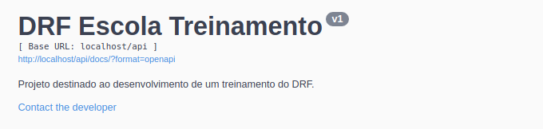
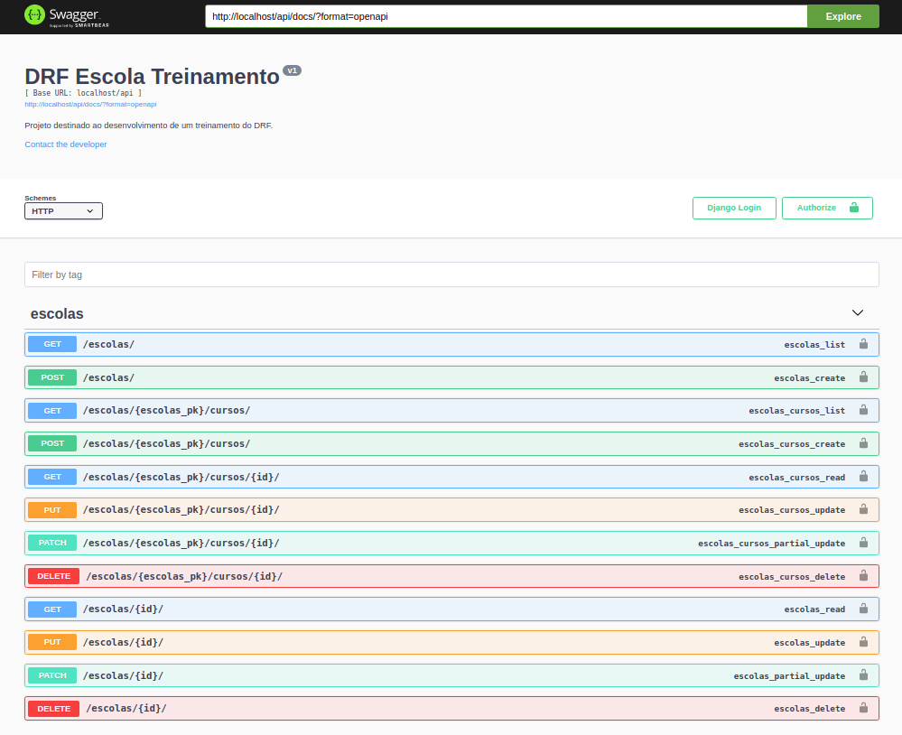
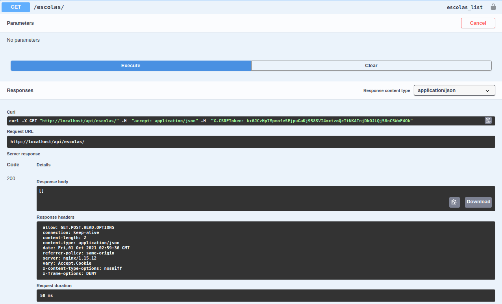
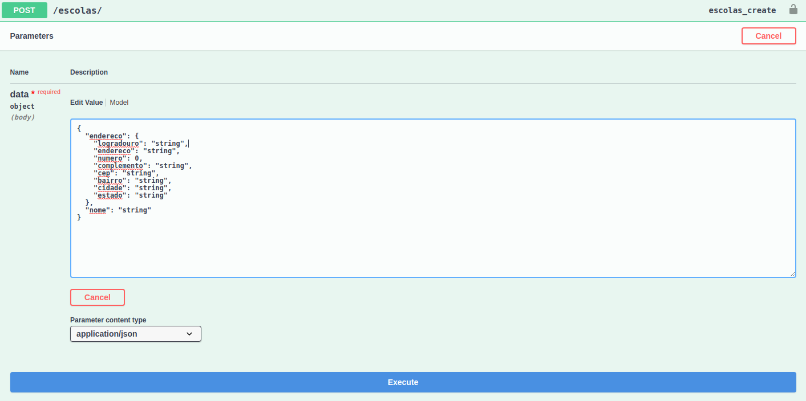
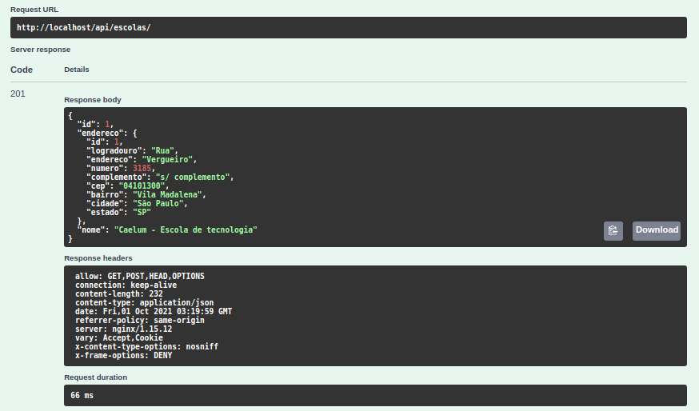
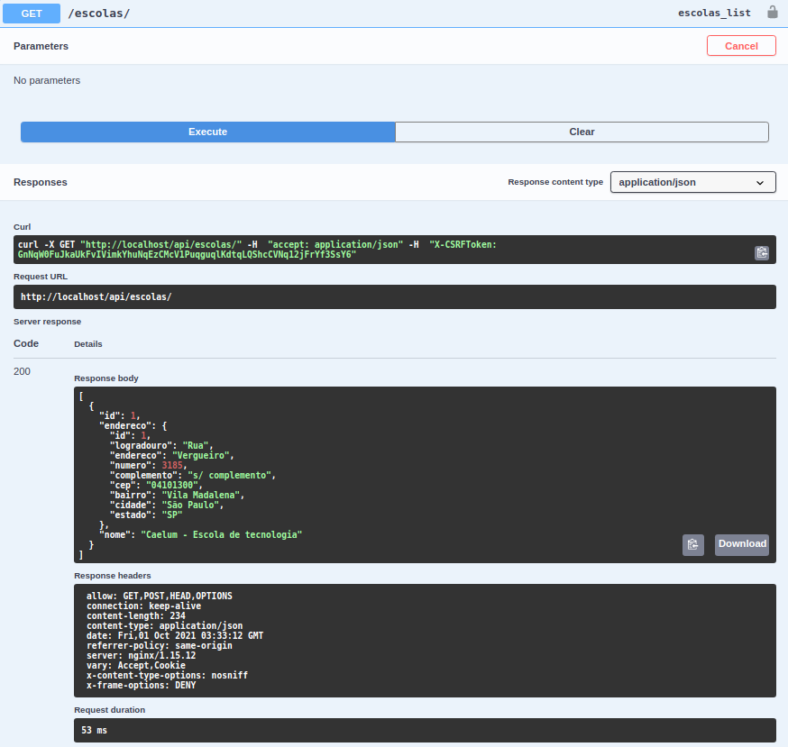

Projeto destinado ao desenvolvimento de conteúdos para tutoriais e vídeos abordando temas básicos e intermediários do 
[Django Rest Framework](https://www.django-rest-framework.org/).

Nosso objetivo aqui é construir uma aplicação de crud passando por validação de dados, parmissão de acesso, documentação
auto gerada, qualidade de código, testes e arquitetura.

## Colocando tudo de pé
### 1. Instalando o docker e o docker-compose
Estamos fazendo o uso de docker para essa arquitetura mínima de uma aplicação funcional em desenvolvimento então,
antes que qualquer outra coisa, você precisa instalar o docker e o docker-compose. 
No windows: [Docker - Instalação, configuraçãoe e primeiros passos](https://balta.io/blog/docker-instalacao-configuracao-e-primeiros-passos), 
para uma introdução ao docker e [Como usar docker-ccompose](https://docs.microsoft.com/pt-br/visualstudio/docker/tutorials/use-docker-compose) 
para o segundo serviço. 
Para a galerinha do Ubuntu, [Como instalar e usar o docker no ubuntu 18.04](https://www.digitalocean.com/community/tutorials/como-instalar-e-usar-o-docker-no-ubuntu-18-04-pt) e,
para a segunda aplicação, [Como instalar o docker compose no ubuntu 18.04](https://www.digitalocean.com/community/tutorials/how-to-install-docker-compose-on-ubuntu-18-04-pt).
No caso do Ubuntu, eu testei esses links para instalar no 20.04 e tudo correu bem também.

### 2. Clonando o repositório
Se tudo tiver dado certo na instalação, você vai precisar clonar esse repositório no seu computador. Para isso,tendo o 
[git](https://git-scm.com/book/pt-br/v2/Come%C3%A7ando-Instalando-o-Git) navegue pelo terminal até o diretório onde 
quer baixar o projeto e `git clone --branch dev https://github.com/LeoFernanndes/drf-escola-treinamento.git`.

### 3. Adicionado as variáveis de abiente
Tudo certo ate agora, vamos adicionar as variáveis de ambiente ao serviço da api. Crie um arquivo .env na dentro da 
pasta api e adicione as seguintes variáveis e seus valores:

    DB_DEV_NAME=postgres
    DB_DEV_USER=postgres 
    DB_DEV_PASSWORD=postgres 
    DB_DEV_HOST=database 
    DB_DEV_PORT=5432

### 4. Vendo a mágica acontecer
`docker-compose up --build` e só. Como não estamos falando de magia, e sim de tecnologia, vamos abordar o que existe por
trás dessec comando que possibilita subir uma aplicação toda em uma só linha de código.

## Testando a aplicação
Depois de colocar tudo de pé, é legal ver como as coisas estão acontecendo. Lembrando que o drf é um framework de backend
a nossa aplicação não vai ter uma interface como as que estamos acostumados a ver na navegação do dia a dia na internet, 
mas graças ao  Swaager que é uma biblioteca padrão de coumentação disponível para vários frameworks implementado aqui com
o [drf-yasg](https://drf-yasg.readthedocs.io/en/stable/) que pode ser entendido um poquinho melhor 
[nesse post aqui](https://medium.com/@arjunsinghy96/customised-api-documentation-for-django-rest-framework-projects-using-drf-yasg-d6db9ba5cff3).

Para ver essa interface que nós já subimos lá com o compose, vamos dar uma olhadinha lá no navegador em 
`http://localhost/api/docs` e vamos ver uma tela parecida com essa:

Essa é uma interface feita para testes e você vai ver clicando em algum ***GET*** sem parâmetro, sem seguida,
***try it out*** e finalmente em ***execute*** que o retorno é um array vazio como esse que pode ser visto no 
campo response: 

Pra criar um registro vamos fazer algum ***POST*** para ver se está tudo funcionando direitinho:

Por padrão a documentação do swagger nos ajuda preenchendo uma requisição ccom valores de teste indicando o tipo de 
dados que deve ser inserido em cada valor do json. Vamos trocar esses valores pra não ficar tão sem graça e clicar em 
***execute*** pra fazer o post.

Vamos ver essa resposta: 

Na resposta temos um resumo com o ***path*** usado para fazer essa requisição, tempo de execução, o corpo da resposta 
que é basicamente uma cópia do que foi enviado na requisição acrescida do id e se prestarmos atenção, vamos ver que 
temos 2 ids, o que indica que foram criados dois recursos sendo que endereço pertence à escola.

Vamos então fazer um ***GET*** em escolas pra ver como ficou:

Já que endereço não faz sentido solto na nossa aplicação, não temos rotas para gerencia-los diretamente. Vamos discutir 
esse tipo de decisao em breve.

## Removendo os containeres
Caso você esteja com o terminal que está rodando a apliação aberto, use `CTRL+C` para interromper o processo, caso ja tenha
fechado a janela, vá novamente para o local onde rodou o `docker-compose up --build` mas agora use `docker-compose donw`
para desmontar os serviços.

